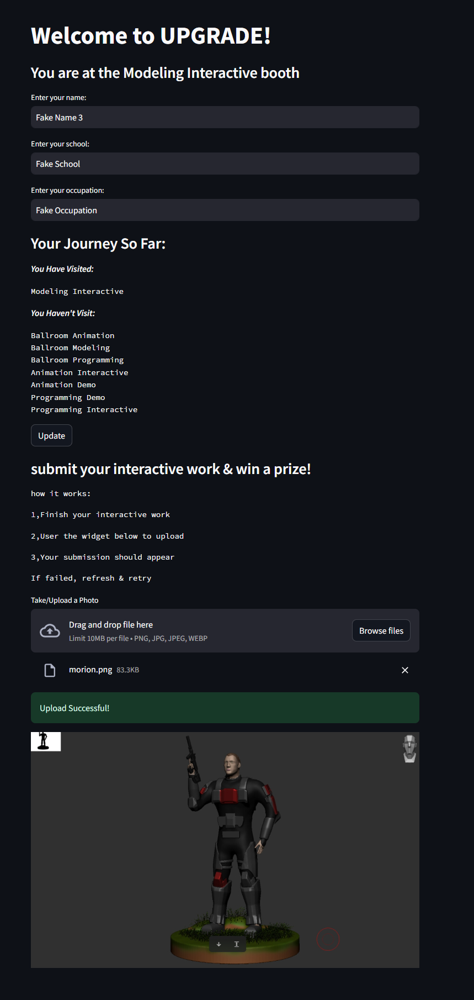
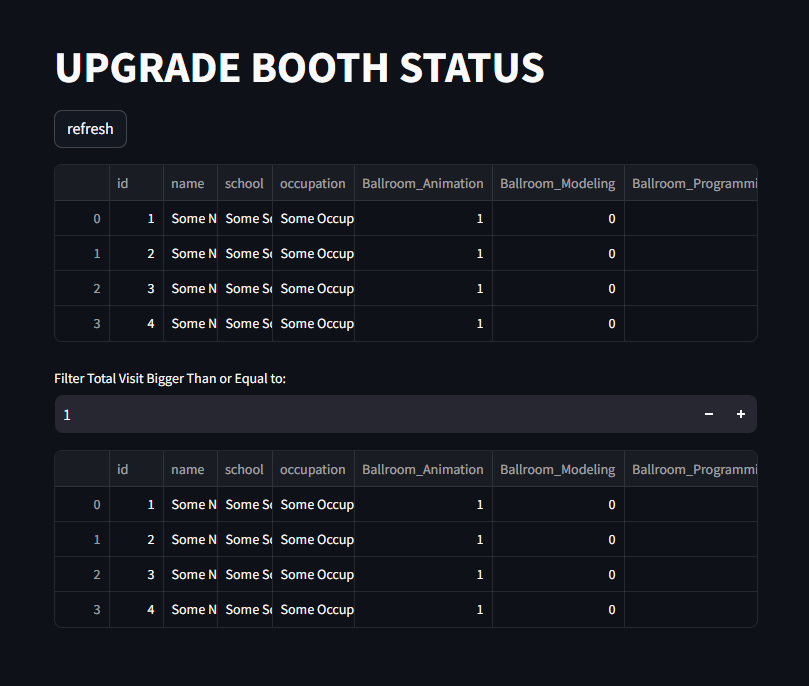
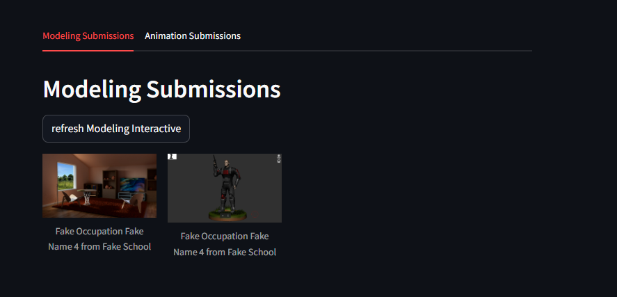
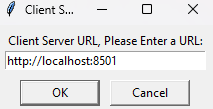
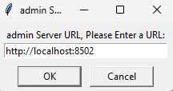
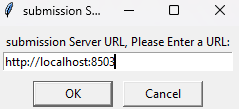

# Conference Query System

---

This conference query system can be used to keep track of the various booths the paticipants has participated in a conference, and allow participants to upload photos & videos. on the front end, it has the client page, the admin page, and the submission view page, as shown in the screen captures below

----

## Client Page



-----

## Admin Page



----

## Submission View Page



----

## Features

* Allowing flexible amout of booths being configured.

* Track what booths a participant has visitied.

* Track the total amout of boothes a participant has visited.

* Allow participant to upload videos and photos to the booth they are at.

* Generate QR Code Automatically for each booth.

* Has admin page to see and download the record.

* The admin page has a fitler to filter the records by the amount of booths visited.

* Has utility functions to retrieve data from server to local machine, and generate csv

* has the submission view page to view submissions of photos and vidoes for desiganated boothes, auto refreshes every 5 seconds.

## Technology

This system is developed with ```python```, and managed with ```poetry```. 

It uses ```Streamlit``` as the front end, and ```sqlite3``` as the back end database. It can be deployed on any system, and can generate qr code for the boothes with the ```qrcode``` and ```pillow``` library.

* versions:

|library  | version |
|---------|---------|
|Python   |  3.12.6 |
|poetry   |  2.1.3  |
|Streamlit|  1.38.0 |
|Sqlite3  |  3.46.1 |
|Pillow   |  10.4.0 |
|QR Code  |  8.0    |

## Structure

The system has 5 major modules:

* The client modules ```userClient.py```, ```adminClient.py```, ```submissionViewClient.py```

    * these module uses the streamlit libaray to build the front ends of the application, each one is a independent streamlit subprocess that occupies a different port on the hosting machine.

    |client  | usage |Port|
    |---------|---------|---|
    |userClient  |  display greeting to users, allow registeration,show status, and upload photos/videos|8501|
    |adminClient   |  for the administrators to check participations |8502|
    |submissionViewClient|  for people to view uploaded photos/videos |8503|

    * To configure which booth will request submission, and what kind of submission, alter the ```GetCompetitionBoothINfo()``` function under [consts.py](./src/conferencequerysystem/consts.py):

        ```py
        def GetCompetitionBoothInfo():
            return {
                        "Modeling_Interactive": ECompetitionSubmitType.Photo,
                        "Animation_Interactive": ECompetitionSubmitType.Video
                }
        ```

* The database module ```database.py```

    The database module handles creating, reading, and writting user data with sqlite3, saving and loading photos & videos of the participants. It uses a simple Queue system to cope with the overhead of loading and saving large files.

* The consts module ```const.py```

    this module stores configurations of the system, in here you can configure the following:

  * the user infomation to collect in the front end (user name, school, etc)

  * the booth names and their codes as a dictionary. The code of the booth is used to generate the qr code for the booth, if the booth code is ```caf414ad66ab482c```, the url embeded in the qr code will be ```http://<server_ip>:8501/c=caf414ad66ab482c``` The url takes in a argument ```c``` with the code value to identify which booth the user scaned.

  * the admin code for the admin page. If the ```c``` argument is the admin code, it will open the admin page.

  * paths of the projects (where is the data base, assets directory, submissions directory, etc)

  * other various paths of the project.

* The qrcode module ```qrCodeGen.py```

    this module can be used to generate qr codes for all the boothes, the admin page, and the submissions view page. it uses the dictionary returned by ```consts.GetBoothNameTable()``` to geneate a qr code for each booth, with their code embeded in the url. And a special code and port for the admin and submissions view.

* the fetch module ```fetch.py```

    this module has functions to copy data from the remote server to local machine, as well as doing filtering to the data, generate csv file, it is also used by the admin front end to filter users by booth count.

    ```NOTE``` the fetch module may not be able to fetch uploaded videos and photos.

## Local Testing

* Be sure to install Ptyhon 3.12.6

* Make sure Python 3.12.6 is the default python executable. 
    - Mac/Linux: 

        Use the update-alternatives to set which python to use (the one with the * before it is the currently used one)

        ```sh
        sudo update-alternatives --config python3 
        ```
    - Windows: 

        Add the path of python 3.12.6 before other python versions in the path evironment variable, so that it becomes the default one.


* Install poetry 2.1.3 (note, if pip does not work, use pip3)
```sh
pip install "poetry==2.1.3"
```

* Instal with poetry, so your project is properly configured with poetry:

```sh
poetry install
```

* Generate QR Code & URLs:
    * User your local area network IP of the hosting machine when generating the QR code.
    * To Generate, see [Generate QR Code](#Generate-QR-Code)

* Launch the server:

```sh
poetry run launchserver
```

* Scan the qrcode to go to the corresponding booth
* You can also use the links in [urls.txt](./output/qrcodes/urls.txt) to go to different parts of the front end.

## Deploy

It is recommend to deploy it with docker and the provided ```docker-compose.yml``` file. You may what to change the service, image, and container name, to yours.
Simply pull the repo to your server, use terminal to navigate to the repo root directory, and run:

```sh
docker-compose build 
```

and then:

```sh
docker-compose up 
```

you can also do the same with the provided ```dockerComposeReBuildAndLaunch.sh```

-----

## Generate QR Code

you can use the qrCodeGen.py to generate qrcode, as along as you have your severs ip address, you can run:

```sh
poetry run qrcodegen
```
the application will promote you to enter 3 urls one by one:





If you are generating on an OS with out GUI support, it should ask the urls through console input.

Assuming you are testing with a local or public ip: ```http://10.40.14.25```, Here is the url setting you should go with

|URL|Example|
|--|--|
|Client Server URL|http://10.40.14.25:8501|
|Admin Server URL|http://10.40.14.25:8502|
|Submission Server URL|http://10.40.14.25:8503|

Notice that the port is embeded, which port to use for which one is determined by the getters under the [const.py](./src/conferencequerysystem/consts.py)
```py
def GetClientServerPort():
    return "8501"

def GetAdminServerPort():
    return "8502"

def GetSubmissionServerPort():
    return "8503"
```

If you are using ```cloudflared```, you should create 3 tunnels:

```sh
cloudflared tunnel --url localhost:8501
cloudflared tunnel --url localhost:8502
cloudflared tunnel --url localhost:8503
```

Copy paste the generated https urls to the client server url, admin server url, and submission server url fields when promoted.

the generate QR code should be under ```output/qrcodes```

A [urls.txt](./output/qrcodes/urls.txt) should also be generated in ```output/qrcodes``` with the actually links for each client & booth

----

## Notes for deploying to AWS EC2

* Use AWS-Linus as the OS

* Ports:
  Open UDP and TCP port 8501, 8502, 8503, you can define it with the sercuriy rules of the EC2.

* You may want to set up password for the user so you can use sudo commands:

```sh
sudo passwd $(whoami)
```

* To install docker on AWS-Linux

    ```sh
    sudo yum update
    sudo yum install docker
    ```

    add docker to the user group

    ```sh
    sudo usermod -aG docker $USER
    ```

    reboot the EC2 instance

* To install docker compose on AWS-Linux

    ```sh
    sudo curl -L "https://github.com/docker/compose/releases/download/v2.6.0/docker-compose-$(uname -s)-$(uname -m)" -o /usr/local/bin/docker-compose
    ```

    ```sh
    sudo chmod +x /usr/local/bin/docker-compose
    ```

```NOTE``` If at this point, docker daemon is not running, simply do:
```sh
systemctrl start docker
```

* to access server with the key:

```sh
ssh -i <yourPrivateSSHkey.pem> ec2-user@<ec2_public_ip>
```

* to inspect the docker contiainer:

```sh
docker exec -it <dockerContainerName> /bin/sh
```

* to copy file out of container to ec2 instance

```sh
docker cp <dockerContainerName>:/app/data/data.db ~/data.db
```

* to copy file out of ec2 instance to local machine

```sh
scp -i <yourPrivateSSHkey.pem> ec2-user@<ec2_public_ip>:~/data/data.db ~/data.db 
```

these 2 can be achieved by navigating to the scripts directory.and run:

```sh
./copyDataToLocal.sh
```