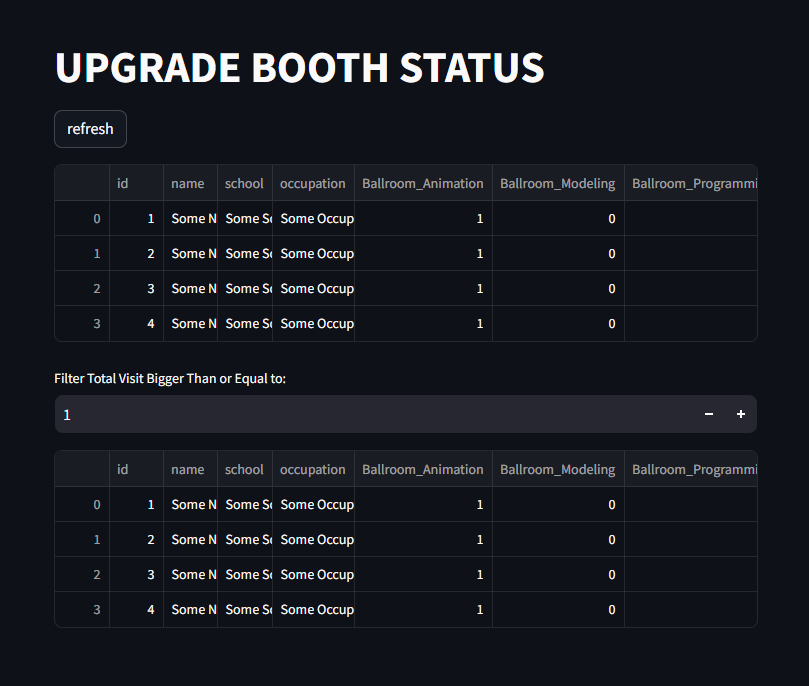

# Conference Query System



## Features

This conference query system can be used to keep track of the various booths the paticipants has participated in a conference.

It has the following features:

* Allowing flexiable amout of booths being configured.

* Track what booths a participant has visitied.

* Track the total amout of boothes a participant has visited.

* Generate QR Code Automatically for each booth.

* Has admin page to see and download the record.

* The admin page has a fitler to filter the records by the amount of booths visited.

* Has utility functions to retrieve data from server to local machine, and generate csv

## Technology

This system is developed with ```python```, it uses ```Streamlit``` as the front end, and ```sqlite3``` as the back end database. It can be deployed on any system, and can generate qr code for the boothes with the ```qrcode``` and ```pillow``` library.

* versions:

|library  | version |
|---------|---------|
|Python   |  3.12.6 |
|Streamlit|  1.38.0 |
|Sqlite3  |  3.46.1 |
|Pillow   |  10.4.0 |
|QR Code  |  8.0    |

## Structure

The system has 5 major modules:

* The app module ```app.py```

    this module uses the streamlit libaray to display the greetings, ask for user info, and allows the user to register and check their current status (what booth they have and haven't visited)

* The database module ```database.py```

    this module handles creating, reading, and writting user data with sqlite3

* The consts module ```const.py```

    this module stores configurations of the system, in here you can configure the following:
  * the user infomation to collect in the front end (user name, school, etc)

  * the booth names and their codes as a dictionary. The code of the booth is used to generate the qr code for the booth, if the booth code is ```caf414ad66ab482c```, the url embeded in the qr code will be ```http://<server_ip>:8501/c=caf414ad66ab482c``` The url takes in a argument ```c``` with the code value to identify which booth the user scaned.

  * the admin code for the admin page. If the ```c``` argument is the admin code, it will open the admin page.

  * the various paths of the project.

* The qrcode module ```qrCodeGen.py```

    this module can be used to generate qr codes for all the boothes, it uses the dictionary returned by ```consts.GetBoothNameTable()``` to geneate a qr code for each booth, with their code embeded in the url.

* the fetch module ```fetch.py```

    this module has functions to copy data from the remote server to local machine, as well as doing filtering to the data, generate csv file, it is also used by the admin front end to filter users by booth count.

## Deploy

It is recommend to deploy it with docker and the provided ```docker-compose.yml``` file. You may what to change the service, image, and container name, to yours.
Simply pull the repo to your server, use terminal to navigate to the repo root directory, and run:

```sh
docker-compose build 
```

and then:

```sh
docker-compose up 
```

you can also do the same with the provided ```dockerComposeReBuildAndLaunch.sh```

## Notes for deploying to AWS EC2

* Use AWS-Linus as the OS

* Ports:
  Open UDP and TCP port 8501, you can define it with the sercuriy rules of the EC2.

* To install docker on AWS-Linux

    ```sh
    sudo yum update
    sudo yum install docker
    ```

    add docker to the user group

    ```sh
    sudo usermod -aG docker $USER
    ```

    reboot the EC2 instance

* To install docker compose on AWS-Linux

    ```sh
    sudo curl -L "https://github.com/docker/compose/releases/download/v2.6.0/docker-compose-$(uname -s)-$(uname -m)" -o /usr/local/bin/docker-compose
    ```

    ```sh
    sudo chmod +x /usr/local/bin/docker-compose
    ```

* to access server with the key:

```sh
ssh -i <yourPrivateSSHkey.pem> ec2-user@<ec2_public_ip>
```

* to inspect the docker contiainer:

```sh
docker exec -it <dockerContainerName> /bin/sh
```

* to copy file out of container to ec2 instance

```sh
docker cp <dockerContainerName>:/app/data.db ~/data.db
```

* to copy file out of ec2 instance to local machine

```sh
scp -i <yourPrivateSSHkey.pem> ec2-user@<ec2_public_ip>:~/data.db ~/data.db 
```

these 2 can be achieved by navigating to scripts.and run:

```sh
./copyDataToLocal.sh
```
